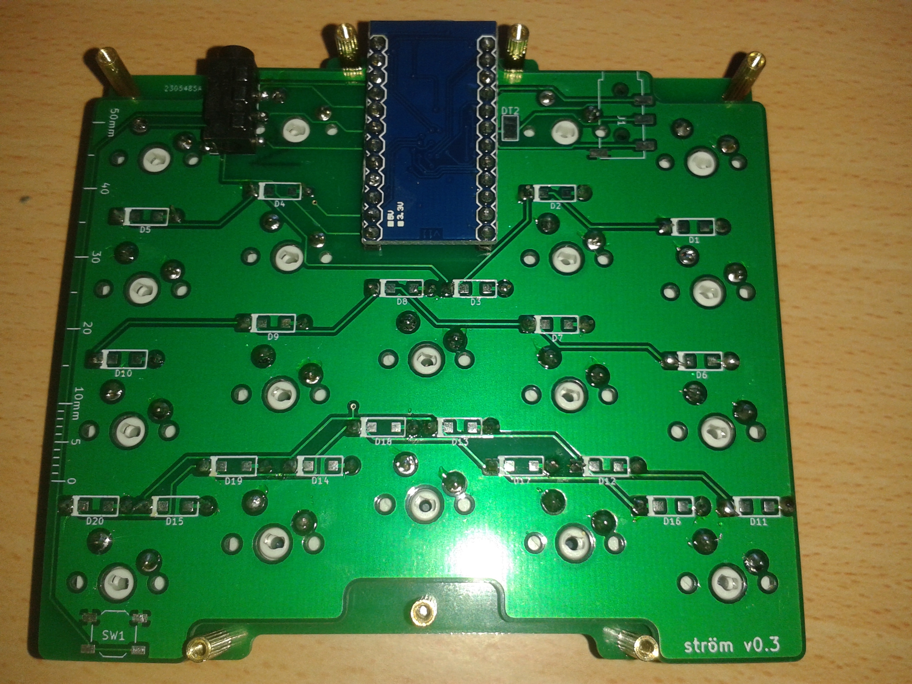

# ström
This repository contains the kicad and gerber files for the ström keyboard.
The PCB and plates are below 100mm x 100mm.
The ström is a split keyboard with 20 column staggered keys on each half.

## BOM
* 2 x Top plate
* 2 x PCB
* 2 x Bottom plate
* 2 x Pro Micro
* 2 x TRRS jack PJ-320D-A
* 1 x TRRS cable
* 40 x Cherry MX compatible switch
* 40 x 1N4148 Diode
* 40 x MX keycap
* 28 x M2x6 screw
* 14 x M2 spacer 11mm
* 8 x Rubber feet

The PCB supports through hole diodes as well as 0805 diodes.

## Assembly
The ström is assembled in a similar fashion as most sandwich style keyboards such as the [Let's Split](https://github.com/nicinabox/lets-split-guide) or the [Gherkin](https://imgur.com/a/O9p7n).
Unlike the Let's split however, the PCB is not invertible, instead it offers two potential footprints for the TRRS jack with the Pro Micro in between, the ström also doesn't require any jumper settings.
The Pro Micro is mounted with the USB towards the PCB on both sides to save space.

1. Solder all the diodes, you can solder them on the top or bottom side of the PCB.
2. Solder the pins/socket for the ProMicro
3. Put all the switches into the top plate. The holes are tight so make sure all the switches are level with the plate.
4. Put the switches with top plate on the PCB, it should be a snug fit.
5. Make sure no switch pins are bent, they should all go through the PCB.
6. Solder the two switches above the ProMicro.
7. Put tape over the ProMicro's USB port and solder or socket the ProMicro.
8. Flash the ProMicro and test the two soldered switches.
9. Solder the TRRS jack to one of the two footprints.
10. Solder the rest of the switches.
11. Put in the screws and spacers, screw in the bottom plate.
12. Flash both sides at least once, you only have to flash the master when you update your keymap in the future.

By default the ström uses the QMK serial connection to communicate between the two halves, although either I2C support or shared RGB backlighting can be added.

### Notes
* TRRS shorts contacts while plugging and unplugging. *Never plug or unplug the TRRS cable while USB is connected.*
* The ProMicro's USB port is close to the solder joint of the switch above, use mask tape or similar over the port to avoid a short.
* If you plan on socketing your ProMicros you may need longer spacers.
* Some diode footprints are very close together, try to avoid solder bridges or use SMD diodes.
* J1 is close to the switch footprint next to it, solder the TRRS jack first.
* You should be able to use 10mm spacers instead of 11mm, although 11mm give you some more room to work with and are recommended.

### I2C
I2C has not been tested but should generally be working, follow the instructions below.

In order to use I2C, Pin 2 (SDA) on the Pro Micro has to be connected to the dormant trace in the TRRS connection, a pad to do so is provided as "DT2" right next to Pin 2, simply jump from the pin to the pad with a short wire.

Additionally I2C requires a 4.7kΩ pull-up resistor to each data line, the best place to add them is one of the empty TRRS jack footprints.
VCC is connected to the right topmost pad, below is DT2 and the other data trace DT1 is the bottommost pad on that side, the single pad on the left side is GND.
Simply use a SMD resistor between VCC and DT2 and solder the legs of a through hole resistor between VCC and DT2.

### RGB backlighting
Use a 3 trace RGB strip, tap DT2, VCC and GND to propagate the color to the other half. Use either pin 9 or pin 10 on the pro micro as RGB pin.

## Flashing

The ström [supports QMK](https://github.com/94k/stroem_firmware).
You can use a flat screw driver to short RST and GND instead of soldering a switch on SW1.

## Todo
* Move diode footprints to provide more space for soldering.
* Rotate some of the keys to provide more space for the TRRS jacks and the USB port.
* Replace TRRS jacks with 5pin Micro USB for I2C *and* backlight.
* Add M2 holes to PCB for plateless builds.
* Reduce size of PCB and plates.
* Provide footprints for I2C resistors.
* Provide jumper footprints for backlighting (master/slave).
* Add ICSP headers.
